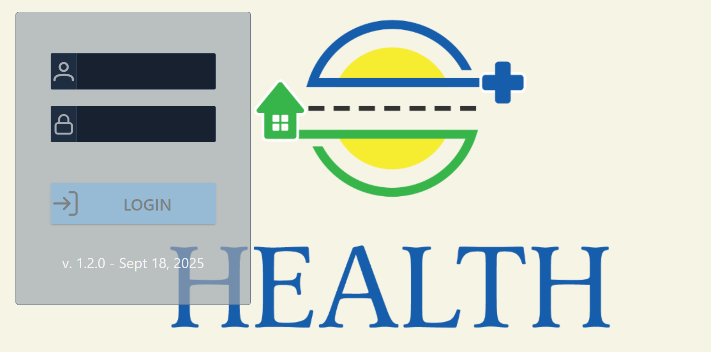
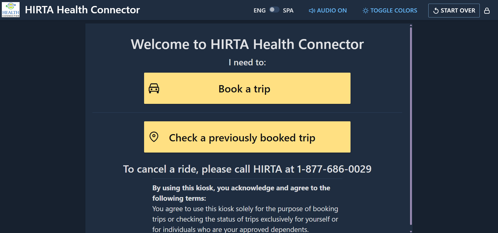
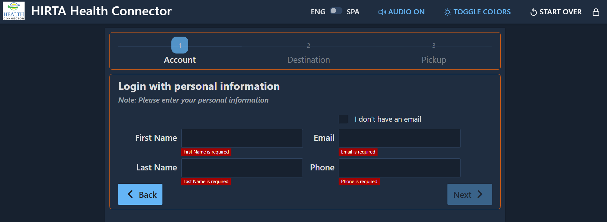
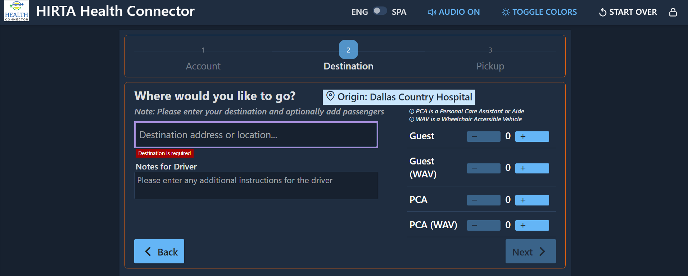

# User Guide

This guide covers how to use the Health Connector Kiosk to book and check a ride. It's written
for kiosk operators and riders — for technical/developer docs, see the [main docs index](../README.md).

> **TODO:** add a screenshot for each screen below. Drop image files into
> `docs/user-guide/images/` and reference them like:
> ``

## 1. Login

The kiosk starts at a login screen. Staff/authorized users sign in with their kiosk account
credentials.

## 2. Lock screen / idle behavior

If the kiosk is left idle, it returns to a lock screen. After a period of inactivity during a
booking, an "Are you still there?" prompt appears before the session resets to the home screen.

## 3. Booking a trip

The booking flow has three steps:

1. **Pickup** — confirm or set the pickup location (defaults to the kiosk's configured location).
2. **Destination** — choose a destination from the map (restricted to the configured service
   area).
3. **Confirm / Book Trip** — review the trip and submit the booking request.

## 4. Checking an existing trip

Riders can check the status of a previously booked trip (pickup ETA, driver info, etc.) from the
"check trip" screen.

## Accessibility

The kiosk includes text-to-speech support and an on-screen touch keyboard for text entry, and
supports English and Spanish (see the language toggle in the top bar).
